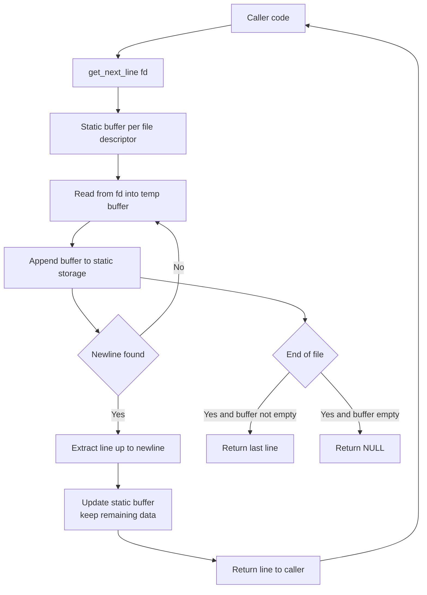

# get_next_line - Read a File Line by Line

  
📌 **42 School - Core Curriculum Project**  

## ▌ Description
The **get_next_line** project is about implementing a function that reads and returns a single line from a file descriptor.  
This project was a great opportunity to work with **static variables, file handling, and memory management** in C.




## ▌ Objectives
▸ Implement **efficient file reading** one line at a time  
▸ Handle **dynamic memory allocation** and **avoid memory leaks**  
▸ Work with **file descriptors** and `read()`  
▸ Implement **bonus features** to support multiple file descriptors  

## ▌ Result: **125% with Bonus**
I successfully completed all mandatory parts and **bonus features**, achieving a perfect **125%** score. 🎉

## ▌ Files
- `get_next_line.h` → Contains function prototypes and required macros  
- `get_next_line.c` → Main function to read a line from a file descriptor  
- `get_next_line_utils.c` → Helper functions for memory management  
- `Makefile` → Automates compilation (`all`, `clean`, `fclean`, `re`, `bonus`)  

## ▌ Implemented Functions
### ■ **Mandatory Part**
| Function | Description |
|----------|-------------|
| `get_next_line(int fd)` | Reads a line from a file descriptor |
| `get_next_line_utils.c` | Contains utility functions for `get_next_line` |

### ■ **Bonus Features**
| Feature | Description |
|---------|-------------|
| ▸ **Multiple File Descriptors** | Handles multiple file descriptors simultaneously |
| ▸ **Single Static Variable** | Optimized memory handling |

### ■ **Forbidden Functions**
- ❌ `lseek()`
- ❌ Global variables
- ❌ Using `libft` functions

## ▌ Compilation & Usage
Since there is **no Makefile**, you must **compile manually** using `gcc`:

### ■ **Compile the Mandatory Part**
You can use get_next_line() in a test file:
```c
#include "get_next_line.h"
#include <fcntl.h>
#include <stdio.h>

int main() {
    int fd = open("file.txt", O_RDONLY);
    char *line;

    while ((line = get_next_line(fd))) {
        printf("%s", line);
        free(line);
    }
    close(fd);
    return 0;
}
```

Compile with your main.c
```sh
gcc -Wall -Wextra -Werror -D BUFFER_SIZE=42 get_next_line.c get_next_line_utils.c main.c -o test_gnl
./test_gnl
```

Don't forget to change the filename or add the content inside it

## 📜 License

This project was completed as part of the **42 School** curriculum.  
It is intended for **academic purposes only** and follows the evaluation requirements set by 42.  

Unauthorized public sharing or direct copying for **grading purposes** is discouraged.  
If you wish to use or study this code, please ensure it complies with **your school's policies**.
